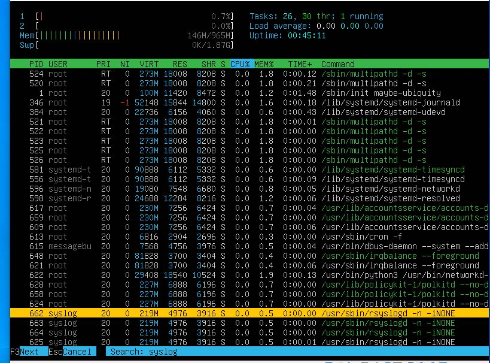
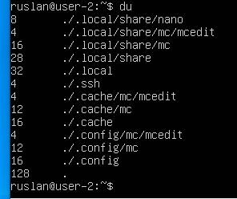

## Part 1. Установка ОС

### Установка операционной системы

-  Устанавливаем виртуальную машину Oracle VirtualBox, скачав программу с официального сайта https://www.virtualbox.org/wiki/Download_Old_Builds_6_0.

- Скачиваем образ Ubuntu 20.04 Server LTS с официального сайта Ubuntu https://releases.ubuntu.com/20.04/.

- Запускаем VirtualBox и создаем новую виртуальную машину. Указываем тип ОС Lunux и версию "Ubuntu 64-разрядная".

- Задаем установленное по умолчанию количество оперативной памяти и размер жесткого диска, а затем создаем новый виртуальный диск.

- После создания переходим в настройки на вкладку "Система" и убеждаемся в том, что у процессора выбрано нужное количество ядер.

- Переходим во вкладку "Хранилище" и выбераем пустой empty контроллер IDE, нажав на иконку голубого диска с плюсом.

- Выбираем "Выбрать виртуальный оптический диск" и указываем путь к образу Ubuntu 20.04 Server LTS.

- Запускаем виртуальную машину, нажав кнопку старт.

- В дальнейшем в новом окне нам надо будет указать язык и после этого выбрать "Install Ubuntu Server" и снова нажмем "Enter".

- В процессе установки указываем все необходимые нам настройки.

- Указываем имя пользователя, юзера, сервера и задаем пароль.

- Выбираем опцию "OpenSSH server".

- После установки перезагружаем виртуальную машину.

### Узнаем версию Ubuntu, выполнив команду
```bash
cat /etc/issue
```


## Part 2. Создание пользователя

### Создание нового пользователя

- Для создания нового пользователя и добавлением его в группу adm выполняем команду.
```bash
sudo useradd -G adm user
```


- Новый пользователь создан.

### Проверка добавления в группу adm 

- Для проверки, что новый пользователь добавлен в группу "adm" выполним команду cat /etc/passwd.
```bash
cat /etc/passwd
```
- В выводе команды мы увидим информацию о новом пользователе.


## Part 3. Настройка сети ОС

### Задай название машины вида user-1
- Выполним команду и зададим новое название для машины:
```bash
sudo hostnamectl set-hostname user-1
```

- Выполним перезагрузку:
```bash
reboot
```
- Выведем новое название:
```bash
hostnamectl
```


### Установим временную зону, соответствующую текущему местоположению.

- Выполним установку временной зоны:
```bash
sudo timedatectl set-timezone Europe/Moscow
```
- Проверим установку временной зоны:
```bash
timedatectl
```


### Выведем названия сетевых интерфейсов с помощью консольной команды.

- Выведем сетевые интерфейсы:
```bash
ifconfig
```


- lo (loopback device) – виртуальный интерфейс, присутствующий по умолчанию в любом Linux. Он используется для отладки сетевых программ и запуска серверных приложений на локальной машине. С этим интерфейсом всегда связан адрес 127.0.0.1. У него есть dns-имя – localhost. Посмотреть привязку можно в файле /etc/hosts.

### Используя консольную команду, получи ip адрес устройства, на котором ты работаешь, от DHCP-сервера.

- Для получения IP-адреса устройства от DHCP сервера вводим команду:
```bash
sudo dhclient enp0s3
```
- Просмотрим полученный адрес:
```bash
ip a
```


- DHCP (англ. Dynamic Host Configuration Protocol — протокол динамической настройки узла) — сетевой протокол, позволяющий сетевым устройствам автоматически получать IP-адрес и другие параметры, необходимые для работы в сети TCP/IP. Данный протокол работает по модели «клиент-сервер». Для автоматической конфигурации компьютер-клиент на этапе конфигурации сетевого устройства обращается к так называемому серверу DHCP и получает от него нужные параметры.

### Определим и выведим на экран внешний ip-адрес шлюза (ip) и внутренний IP-адрес шлюза, он же ip-адрес по умолчанию (gw).

- Внешний ip-адрес шлюз: 
```bash
curl ifconfig.me
```


- Внутренний ip-адрес шлюз: 
```bash
ip route | grep default
```


### Зададим статичные (заданные вручную, а не полученные от DHCP-сервера) настройки ip, gw, dns (испольуя публичные DNS-серверы, например 1.1.1.1 или 8.8.8.8).

- Для задания статичных IP-адреса, шлюза и DNS серверов, редактируем файл:
```bash
vim /etc/netplan/00-installer-config.yaml
```


- Выполним перезагрузку:
```bash
reboot
```
- Проверим настройки:
```bash
ping 1.1.1.1
```


```bash
ping 8.8.8.8
```


```bash
ping -c 8 ya.ru
```


## Part 4. Обновление ОС

- Обновим список пакетов: 
```bash
sudo apt update
```

- Установим обновления: 
```bash
sudo apt upgrade
```
- Все обновления установлены, о чем свидетельствует нулевое количество пакетов доступных к обновлению: 


## Part 5. Использование команды sudo

- Разрешим пользователю из Part2 выполнять команды с правами супепользователя: 
```bash
sudo usermod -aG sudo user
```

- Команда sudo (от английского "superuser do") предоставляет возможность выполнения команд с правами суперпользователя (root) или другого пользователя с правами администратора. В Linux безопасность очень важна, и команда sudo помогает предотвратить случайные или нежелательные действия с правами администратора. Вместо постоянного входа под пользователем с полными правами, вы можете временно повышать привилегии при необходимости, указав перед командой sudo. При этом система запросит ваш пароль для подтверждения вашей личности.

- Установим обновления: 
```bash
sudo -u user sudo hostnamectl set-hostname user-2
```
- Делаем перезагрузку: 
```bash
reboot
```
- Проверяем новое имя: 
```bash
hostnamectl
```


## Part 6. Установка и настройка службы времени

- Настроим службу автоматической синхронизации времени.: 
```bash
sudo systemctl enable systemd-timesyncd
sudo systemctl start systemd-timesyncd
```
- Выведим время часового пояса:


- Выведим NTPSynchronized=yes:
```bash
timedatectl show
```


## Part 7. Установка и использование текстовых редакторов
- Установим редакторы:
```bash
sudo apt install vim nano mc
```

### Создание файлов test_X.txt
- Редактор vim:
```bash
vim test_VIM.txt
```

Для сохранения и выхода из редактора нажимаем ESC и пишем ":wq".

- Редактор nano:
```bash
nano test_NANO.txt
```

Для сохранения нажимаем Ctrl+o, для выхода Ctrl+x.

- Редактор mcedit:
```bash
mcedit test_MCEDIT.txt
```

Для сохранения нажимаем F2, для выхода F10.

### Пишем в файлы "21 school 21"
- Редактор vim:
```bash
vim test_VIM.txt
```

Для выхода из редактора нажимаем ESC и пишем ":q!".

- Редактор nano:
```bash
nano test_NANO.txt
```

Для выхода Ctrl+x, выбираем N.

- Редактор mcedit:
```bash
mcedit test_MCEDIT.txt
```

Для выхода F10, выбираем Нет (No)

### Поиск и замена слова
- Редактор vim:
```bash
vim test_VIM.txt
```

- Для поиска слова, например, 'School'
  - Нажимаем ESC
  - Вводим комбинацию /School.Выполняется поиск первого вхождения искомого слова
  - Чтобы перейти к следующему найденному слову Нажимаем Enter и нажимаем n, к предыдущему - N


- Для замены слова, например, 'School'- > SchooF
  - Нажимаем ESC
  - Вводим комбинацию :s/School/SchooF Выполняется поиск первого вхождения искомого слова
  - Нажимаем Enter. Осуществялется замена


- Редактор nano:
```bash
nano test_NANO.txt
```

- Для поиска слова, например, 'School'
  - Нажимаем комбинацию ctrl + W
  - Вводим искомое слово
  - Нажимаем Enter. Словой найдено
  - Чтобы перейти к следующему найденному слову нажимаем комбинацию ctrl + W


- Для замены слова, например, 'School'- > Schoof
  - Нажимаем ctrl + \
  - Вводим заменяемое слово: School
  - Нажимаем Enter
  - Вводим новое слово: Schoof
  - Нажимаем Enter


- Редактор mcedit:
```bash
mcedit test_MCEDIT.txt
```

- Для поиска слова, например, 'School'
  - Нажимаем F7
  - Вводим искомое слово
  - Нажимаем Enter. Словой найдено
  - Чтобы перейти к следующему найденному слову нажимаем F7, нажимаем Enter


- Для замены слова, например, 'School'- > Schoof
  - Нажимаем F4
  - Вводим заменяемое слово: School
  - Нажимаем Tab. Вводим новое слово: Schoof
  - Нажимаем Enter
  - Выбираем "Заменить"


## Part 8. Установка и базовая настройка сервиса SSHD
### Устанавливаем и настраиваем службу SSHd
- Служба устанавливается командой:
```bash
sudo apt install openssh-server
```
- Добавляем автостарт службы командой:
```bash
sudo systemctl enable ssh
```
- Перенастроим работу службы на порт 2022. Для этого откроем файл конфигурации в редакторе: 
```bash
sudo mcedit /etc/ssh/sshd_config
```
- Изменим строку которая содержит '#Port 22':


- Проверяем наличие процесса sshd с помощью команды ps и подбираем ключи для вывода нужной информации:
```bash
ps -aux | grep sshd
```
- Объяснение значения команды и каждого ключа в ней:
  - ps - выводит информацию о процессах
  - -aux - ключи для вывода всех процессов пользователя, включая процессы других пользователей и системные процессы
   - | - конвейерная команда для передачи вывода команды ps -aux на вход команде grep
  - grep sshd - команда для поиска процессов, связанных с sshd
  


### Перезагрузка системы:
 ```bash
reboot
```

###  Вывод команды netstat -tan

- Устанавливаем утилиту netstat командой:

```bash
sudo apt install net-tools
```
- Провеяем, что служба слушает на порту 2022:

```bash
netstat -tan
```


### Объяснение значения ключей -tan и каждого столбца вывода:
- netstat - команда для вывода сетевой статистики, включая информацию о сетевых соединениях и портах
- -t - флаг для вывода только TCP-соединений
- -a - флаг для вывода всех сетевых соединений и портов, включая слушающие
- -n - флаг для вывода числовых значений портов вместо их имён

### Значения столбцов вывода:

  - tcp - протокол TCP.
  - 0 0 0.0.0.0:2022 - локальный адрес 0.0.0.0 и порт 2022, что означает, что служба слушает на всех доступных IP-адресах на порту 2022.
  - 0.0.0.0:* - внешний адрес 0.0.0.0 и звёздочка вместо порта, что означает, что служба слушает на всех доступных IP-адресах на любом порту.
  - LISTEN - состояние прослушивания, что означает, что служба активно слушает на этом порту и готова принимать соединения.

## Part 9. Установка и использование утилит top, htop
- Выполняем команду:

```bash
sudo top
```


- По выводу команды определим:
  - uptime: 1 минута
  - количество авторизованных пользователей: 1
  - средняя загрузка системы: 0,20; 0,10; 0,04 - загрузка системы за последние 1, 5 и 15 минут
  - общее количество процессов: 109
  - загрузка cpu: 0,2 us, 0,2 sy, 0.0 ni, 99.7 id, 0.0 wa, 0.0 hi, 0.0 si, 0.0 st
  - загрузка памяти MiB: 964,8 total, 595,1 free, 146,3 used, 223,5 buff/cache 
  - pid процесса занимающего больше всего памяти: 630
  
  - pid процесса, занимающего больше всего процессорного времени: 1

- Выполняем команду:

```bash
sudo htop
```
- Нажимаем F6 и выбираем поля для сортировки:
  -  PID
  
  -  PERCENT_CPU
  
  -  PERCENT_MEM
  
  -  TIME
  

- Нажимаем фильтр F4 и вводим 'sshd':


- Нажимаем поиск F3 и вводим 'syslog':


- Нажимаем F2 и добавляем в интерфейс hostname, clock и uptime:
  


## Part 10. Использование утилиты fdisk

- Выполняем команду:

```bash
sudo fdisk -l
```

- Название жесткого диска, его размер, количество секторов:
    - Диск: /dev/sda
    - Размер: 10 GiB
    - Количество секторов: 20971520

- Для получения размера swap выполняем команду:
```bash
free -h
```

Размер swap: 1.9 GiB

## Part 11. Использование утилиты df
- Запустите команду df, введите в терминале следующую команду:

```bash
df /
```


* Размер раздела : 10215700
* Размер занятого пространства : 4863344
* Размер свободного пространства : 4811840
* Процент использования : 51%
* Тип - килобайты

- Запустите команду df -Th для получения информации о дисковом пространстве с выводом типов файловых систем:

```bash
df -Th /
```


* Размер раздела : 9.86G
* Размер занятого пространства : 4.7G
* Размер свободного пространства : 4.6G
* Процент использования : 51%
* Type - ext4

## Part 12. Использование утилиты du
 - Запустим команду
```bash
du
```

 - Найдем размеры папок /home, /var, /var/log, выполнив команды: 
```bash
sudo du -hsb /home
```
```bash
sudo du -hsb /var
```
```bash
sudo du -hsb /var/log
```


 - Найдем размеры /var/log (не общее, а каждого вложенного элемента), выполнив команды: 
```bash
sudo du -h /var/log/*
```


## Part 13. Установка и использование утилиты ncdu
 - Выполним установку ncdu:
```bash
sudo apt install ncdu
```
 - Найдем размеры папок /home, /var, /var/log, выполнив команды: 
```bash
sudo ncdu /home/
```

```bash
sudo ncdu /var/
```

```bash
sudo ncdu /var/log/
```


## Part 14. Работа с системными журналами
- Прострим журналы с логами:
```bash
cat /var/log/dmesg
```
```bash
cat /var/log/syslog
```
```bash
cat /var/log/auth.log
```

- /var/log/dmesg - содержит сообщения ядра Linux, включая информацию о загрузке оборудования и других низкоуровневых событий
- /var/log/syslog - содержит системные сообщения, включая информацию о работе служб и приложений
- /var/log/auth.log  - содержит информацию о событиях аутентификации, включая попытки входа в систему и успешные авторизации

- в журнале /var/log/auth.log найдем последнюю успешную авторизацию:

  - время: 19:39:27
  - имя пользователя: ruslan (uid=0) - id=0 указывает на пользователя root.
  - метод входа: sudo

- Перезапуск SSHD и просмотр журнала с логами:
```bash
sudo systemctl restart sshd
```
```bash
cat /var/log/auth.log
```

- время рестарта: 20:10:34

## Part 15. Использование планировщика заданий CRON
 - Открываем планировщик в редакторе:
```bash
sudo crontab -e
```
 - Добавляем задание в файл:

 

 - Найдем в системном журнале записи о выполнении крона uptime:
```bash
cat /var/log/syslog | grep 'uptime'
```
 

  - Выведем список текущих заданий в планировщике:
```bash
sudo crontab -l
```
 

  - Удалим задания из планировщике:
```bash
sudo crontab -r
```

   - Выведем список текущих заданий в планировщике:
```bash
sudo crontab -l
```
 

 - Видим что список пуст